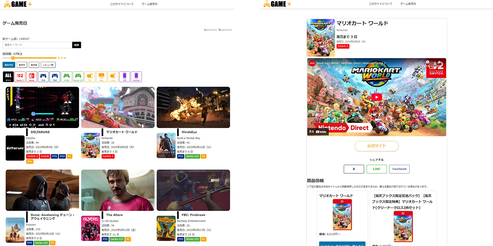

# Cocoon Child – Game Detail

## 概要

Cocoon テーマの子テーマで、固定ページテンプレート「Game Detail」を追加します。
このテンプレートを利用すると、ゲーム情報を API（独自 DB／IGDB など）から取得し、リリース状況やプラットフォーム情報を一覧表示できます。

- **子テーマ名**：Cocoon Child – Game Detail
- **テンプレート名**：Game Detail (`game-detail.php`)

## デモサイト

- **サンプル URL**：[https://game-plusplus.com/release/](https://game-plusplus.com/release/)



## 主な機能一覧

この「Game Detail」テンプレートには、以下のような機能が含まれています。順番に見ていきましょう：

1. **レスポンシブ対応**

   - PC、タブレット、スマホなど、画面の幅が変わってもレイアウトが崩れにくくなっています。

2. **ゲーム情報の自動取得**

   - サーバー内のデータベースや外部のゲーム情報サイト（IGDB など）からリアルタイムでデータを取得します。

3. **リリース状況の表示**

   - ゲームが「未発売」「発売済み」「発売中止」など、今どの状態にあるかを自動で判定して表示します。

4. **プラットフォームアイコン表示**

   - PlayStation、Xbox、Nintendo Switch、PC（Steam）など、対応プラットフォームのロゴやアイコンを表示します。

5. **ゲーム概要の折りたたみ表示**

   - 長いゲームの説明文は一部だけ表示し、「続きを読む」をクリックすると全文が見られる仕組みです。

6. **メタクリティックスコアの取得**

   - 外部サービス（RAWG API など）から評価スコアを取得し、「★★★★☆」のように星で表示できます。

7. **ジャンルやモードの日本語表示**

   - 英語で返ってくるジャンル名やプレイモード（シングル/マルチなど）を日本語に変換して見やすく表示します。

8. **必要スペック情報の表示**

   - PC 版向けに最低動作環境や推奨動作環境を表形式で表示します。

9. **アイキャッチ画像表示**

   - ゲームのメインビジュアルをアイキャッチ画像として設定し、大きく表示できます。未設定の場合はデフォルト画像が表示されます。

10. **キャッシュ機能で高速表示**

    - 一度取得したデータは一時的に保存（キャッシュ）し、同じゲームに再度アクセスする際はキャッシュを参照して表示を高速化します。

11. **自動更新（バックグラウンド）**

    - 毎日深夜にサーバーが自動で最新情報を取得し、キャッシュを更新します。これにより、ユーザーは常に最新のデータを閲覧できます。

12. **エスケープ処理で安全表示**

    - ユーザー入力や外部から取得したデータはすべて安全に表示できるようにフィルタリング・サニタイズしています。

## 必要条件

- 親テーマとして **Cocoon** がインストール済みであること

  - 親テーマが `wp-content/themes/cocoon-master` というフォルダ名である前提です。
  - もし違うスラッグになっている場合は、`style.css` の `Template:` 行を修正してください。

- WordPress 本体：バージョン 5.8 以上
- PHP：バージョン 7.4 以上
- 取得元 API キー・DB 設定など（もし `inc/game-list/class-game-detail.php` 内で環境依存の変数がある場合は、個別にご用意ください）

## インストール手順

1. **親テーマ「Cocoon」をインストール**

   - `wp-content/themes/` 以下に、親テーマフォルダ `cocoon-master` が配置されていることを確認してください。

2. **本リポジトリをクローンまたは ZIP ダウンロード**

   ```bash
   git clone https://github.com/YourUserName/cocoon-child-game-detail.git
   ```

3. **子テーマフォルダを WordPress に配置**

   ```bash
   cd cocoon-child-game-detail
   cp -R . /path/to/wordpress/wp-content/themes/cocoon-child-game-detail
   ```

4. **WordPress 管理画面で子テーマを有効化**

   - 管理画面「外観 → テーマ」から「Cocoon Child – Game Detail」を有効化します。

5. **固定ページ「Game Detail」を作成**

   1. 管理画面「固定ページ → 新規追加」で任意の固定ページを作成
   2. 右サイド「ページ属性」→「テンプレート」から **Game Detail** を選択して公開
   3. 公開後、該当ページを表示するとゲーム詳細情報が自動で読み込まれ、表示されます。

## 外部 API／独自 DB 連携によるゲーム詳細データ取得

1. **データ取得の概要**

   - `inc/game-list/class-game-detail.php` 内のメソッドが、指定されたゲーム ID を元にデータベースまたは外部 API を呼び出し、詳細データを取得します。
   - 取得対象は主に以下の情報です：

     - ゲームタイトル、発売日、リリースステータス（未発売・発売済み・中止など）
     - プラットフォーム一覧（例：PlayStation 5、Xbox Series X、Nintendo Switch、PC（Steam）など）
     - メタクリティックスコア（RAWG API 等から取得）
     - ジャンル、プレイモード（シングル/マルチ）、開発会社、販売元などのメタ情報

2. **DB 連携の流れ**

   - WordPress の `$wpdb` グローバルオブジェクトを利用して、独自テーブル（例：`wp_game_details`）から該当レコードをクエリします。
   - SQL 実行例：

     ```php
     global $wpdb;
     $table_name = $wpdb->prefix . 'game_details';
     $query = $wpdb->prepare(
         "SELECT * FROM {$table_name} WHERE game_id = %d LIMIT 1",
         $game_id
     );
     $detail = $wpdb->get_row($query, ARRAY_A);
     ```

   - 取得したデータ配列を整形し、必要なら `sanitize_text_field()` や `absint()` を使ってサニタイズした後に返します。

3. **外部 API（IGDB／RAWG 等）連携の流れ**

   - **IGDB API** から基本情報を取得

     - 事前に IGDB（Epic Games 社）に開発者登録し、`Client-ID` と `Bearer Token`（IGDB API キー）を取得。
     - PHP で `wp_remote_post()` を利用し、以下のように POST リクエストを送ります：

       ```php
       $endpoint = 'https://api.igdb.com/v4/games';
       $body = 'fields name, platforms.name, first_release_date, genres; where id = ' . intval($igdb_id) . ';';
       $response = wp_remote_post($endpoint, [
           'method'  => 'POST',
           'headers' => [
               'Client-ID'     => 'YOUR_IGDB_CLIENT_ID',
               'Authorization' => 'Bearer ' . IGDB_API_KEY,
               'Accept'        => 'application/json',
           ],
           'body'    => $body,
           'timeout' => 20,
       ]);
       if (!is_wp_error($response)) {
           $data = json_decode(wp_remote_retrieve_body($response), true);
           // $data[0] にゲーム情報が格納されている想定
       }
       ```

   - **RAWG API** からメタクリティックスコアなどを追加取得

     - RAWG に開発者登録し、API キーを取得。
     - ゲームスラッグやタイトルを元に、以下のようにリクエスト：

       ```php
       $slug = sanitize_title_with_dashes($game_title);
       $endpoint = "https://api.rawg.io/api/games/{$slug}?key=" . RAWG_API_KEY;
       $response = wp_remote_get($endpoint, [ 'timeout' => 20 ]);
       if (!is_wp_error($response)) {
           $rawg_data = json_decode(wp_remote_retrieve_body($response), true);
           $metacritic = isset($rawg_data['metacritic']) ? intval($rawg_data['metacritic']) : null;
       }
       ```

   - IGDB と RAWG の両方を連携することで、リリース日やジャンル情報だけでなく、メタクリティック評価を表示できます。

4. **キャッシュと自動更新**

   - **トランジェント API を利用したキャッシュ機能** -データ取得後、`set_transient('ccgd_game_detail_' . $game_id, $detail, DAY_IN_SECONDS)` のように、一日（24 時間）キャッシュ。 -次回同じゲーム ID でアクセスがあった場合は `get_transient()` を優先して返すため、外部 API へ再リクエストしません。
   - **WP Cron を使った自動更新**

     - 毎日深夜（例：午前 3 時）にキャッシュを強制更新するために、以下のようにスケジュールを登録：

       ```php
       add_action('ccgd_refresh_game_details_event', 'ccgd_refresh_all_game_details');
       if (!wp_next_scheduled('ccgd_refresh_game_details_event')) {
           wp_schedule_event(strtotime('03:00:00'), 'daily', 'ccgd_refresh_game_details_event');
       }

       function ccgd_refresh_all_game_details() {
           $game_ids = get_all_game_ids();
           foreach ($game_ids as $id) {
               $detail = ccgd_fetch_game_detail($id, true);
               set_transient('ccgd_game_detail_' . $id, $detail, DAY_IN_SECONDS);
           }
       }
       ```

     - これにより深夜にバックグラウンドでデータ更新が行われ、ユーザーには常に最新情報が表示されます。

## フォルダ構成

```
cocoon-child-game-list/
├─ .gitignore
├─ README.md
├─ style.css
├─ functions.php
├─ game-detail.php
├─ inc/
│   └─ game-list/
│       ├─ class-game-db.php         ← 独自 DB 連携ロジック
│       ├─ class-game-detail.php     ← 外部 API 取得・キャッシュ管理
│       └─ class-platform-info.php   ← プラットフォーム情報取得
└─ assets/
    ├─ css/
    │   └─ game-detail.css
    └─ js/
        └─ game-detail.js
```

## 今後の改善ポイント

- テンプレート内の HTML 部分を `get_template_part()` などで細かく分割し、可読性を向上させる
- 管理画面の「Cocoon 設定」→「子テーマ設定」画面で API キーやキャッシュ期間を入力できるオプション機能を追加
- PHPUnit／WordPress テストフレームワークを使って、`inc/game-list/class-game-detail.php` のデータ取得ロジックをユニットテスト
- エラーハンドリング強化：API 接続障害時にユーザー向けメッセージを表示しつつログ出力を行う
- キャッシュクリア用の管理画面ボタンを追加して、手動で任意のタイミングで全キャッシュをリセット
